# 🧠 Alteryx | End-to-End Analytics Engineering, Spatial Intelligence & Automated Reporting System

An end-to-end analytics engineering system built in **Alteryx Designer** that ingests raw multi-source retail food & beverage data, engineers analytical datasets, performs spatial modeling, and generates fully automated business reports.

This project demonstrates how raw CSV and Excel files become **trusted analytical datasets, spatial intelligence, reusable macros, analytic applications, and polished executive-ready reports** through a modular, scalable, and production-style Alteryx workflow architecture.

Rather than focusing on dashboards alone, this project emphasizes **workflow engineering, automation, and system design** — showing how complex data pipelines are architected, orchestrated, and operationalized inside Alteryx.

This repository is intentionally structured to showcase not just *what* was built, but *how* and *why* architectural decisions were made across ingestion, transformation, spatial processing, automation, and reporting layers.

---

## 🚀 Project Overview

This solution simulates a real-world analytics engineering environment supporting a retail food & beverage data aggregator responsible for consolidating transaction data, customer information, product details, reviews, locations, and geospatial attributes into a unified analytics foundation.

The workflow is designed to:

- Ingest heterogeneous flat files  
- Clean and standardize schemas  
- Integrate relational datasets  
- Engineer analytical features  
- Perform spatial modeling  
- Automate aggregations  
- Generate reusable outputs and reports  

**Design Philosophy**

The system is built around three principles:

1. **Modularity** – isolate logic by function  
2. **Reusability** – abstract repeat logic into macros & apps  
3. **Automation-first** – outputs are generated programmatically  

This ensures scalability, maintainability, and production reliability.

Additional emphasis is placed on building workflows that can be **extended without redesign**, enabling new data sources, metrics, or outputs to be added with minimal disruption.

---

## 🏗️ Architecture Philosophy

The workflow follows a **container-driven modular architecture**:

- Each major function exists in its own container  
- Heavy transformations are separated from reporting  
- Spatial analytics is isolated from transactional processing  
- Reusable logic is encapsulated in macros  
- Output generation is centralized  

**Why this matters**

Large Alteryx workflows collapse when everything is chained linearly.  
Containers create **engineering boundaries** that mirror enterprise design patterns and drastically improve readability, debugging, and extensibility.

This approach also enables:

- Faster troubleshooting  
- Safer refactoring  
- Clear ownership of logic  
- Easier onboarding for new developers  

---

## 🔎 Workflow Architecture Overview

### 🔁 Full Workflow Overview
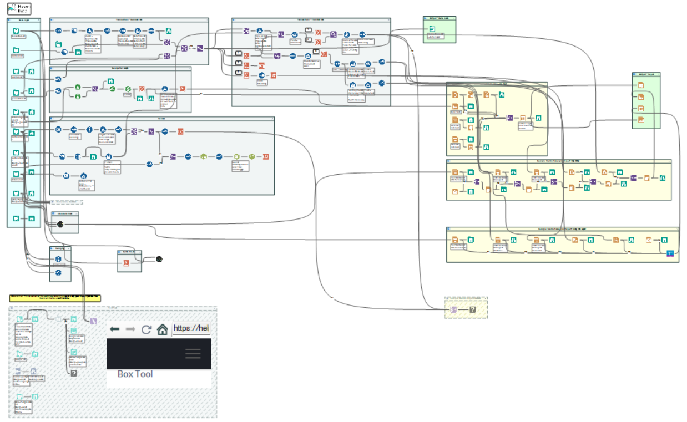

A fully zoomed-out view showing the entire system from ingestion through automated reporting.

**Why this screenshot exists**

It establishes scope, complexity, and architectural intent before diving into details.

At a glance, reviewers can see:

- Multiple functional domains  
- Parallel processing paths  
- Dedicated reporting pipelines  
- Macro and app integration  

---

### 🧱 Workflow with Containers Labeled
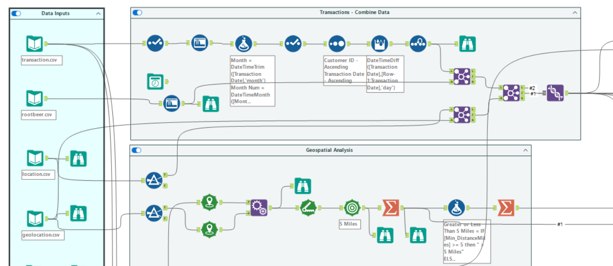

Medium-zoom view where container titles are readable and functional domains are visible.

**Design Decision**

Containers enforce separation of concerns, allowing each section to be reasoned about independently while still participating in a single orchestrated pipeline.

This mirrors how production analytics platforms are structured into layers rather than monolithic scripts.

---

## 📥 Data Ingestion Layer

### Data Inputs Overview
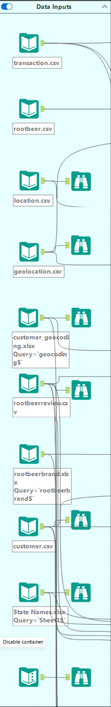

Multiple CSV and Excel sources including transactions, customers, products, reviews, locations, geolocation references, and lookup tables.

**Engineering Approach**

- Input Data / Dynamic Input  
- Select for schema enforcement  
- Browse for validation  

**Design Decision**

Schema is controlled immediately at ingestion so downstream logic never compensates for dirty or ambiguous field types.

Additional considerations:

- Column renaming is standardized early  
- Data types are enforced consistently  
- Invalid records can be isolated before propagation  

This ensures downstream transformations operate on predictable structures.

---

## 🧹 Transaction Data Preparation & Integration

### Transactions Data Preparation
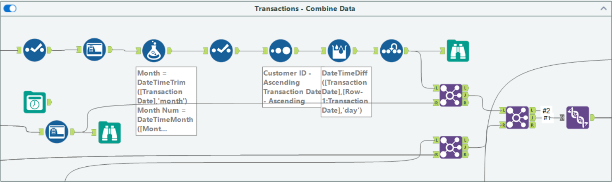

Standardizes raw transactions and integrates relational attributes.

**Tools & Techniques**

- Data Cleansing  
- Formula / Multi-Field Formula  
- Multi-Row Formula  
- Sort & Record ID  
- Join Multiple  
- Union  

**Design Decision**

Join Multiple is used to centralize relational enrichment, preventing deeply nested join chains and improving maintainability.

Transformations here focus on:

- Standardizing keys  
- Creating derived measures  
- Normalizing text fields  
- Aligning schemas across sources  

---

## 🔧 Advanced Transaction Transformations

### Transactions Advanced Transformations
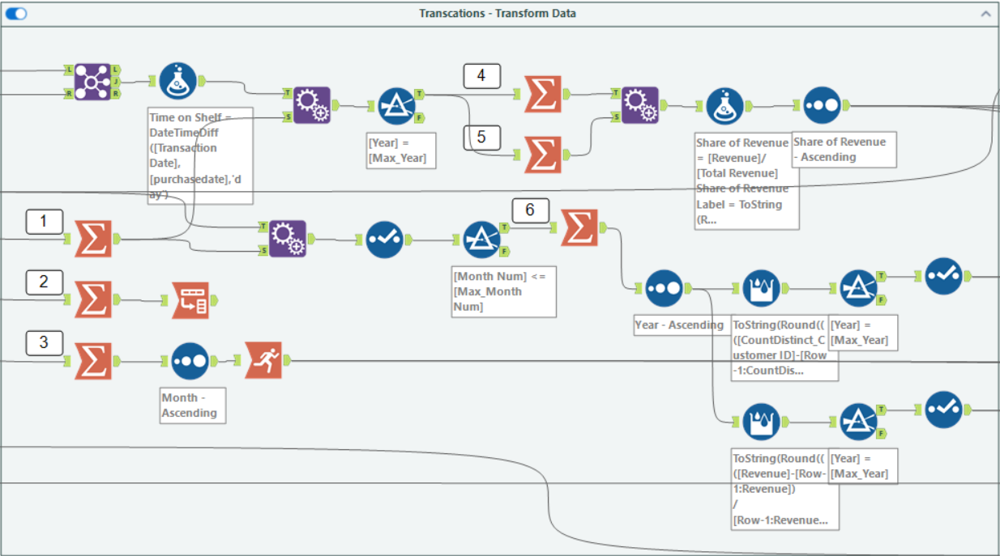

Creates analytical features and derived measures.

**Tools**

- Filter  
- Summarize  
- Running Total  
- Append Fields  

**Design Decision**

Separating base preparation from advanced transformations allows the same clean dataset to support multiple downstream use cases.

This layer produces analytics-ready tables optimized for reporting, macros, and apps.

---

## 🗺️ Spatial Analytics & Trade Area Modeling

### Spatial Analysis Workflow
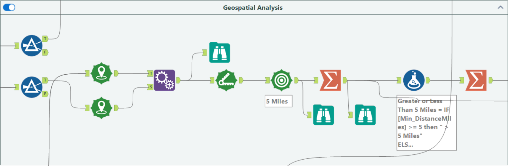

**Tools**

- Create Points  
- Distance  
- Trade Area  
- Append Fields  
- Summarize  

**Design Decision**

Spatial logic is isolated so geospatial objects never contaminate transactional pipelines, enabling independent tuning and reuse.

This layer transforms location data into **decision-ready geographic intelligence**.

---

## ♻️ Reusable Engineering Components

### Standard Macro – Reviews ↔ Customers
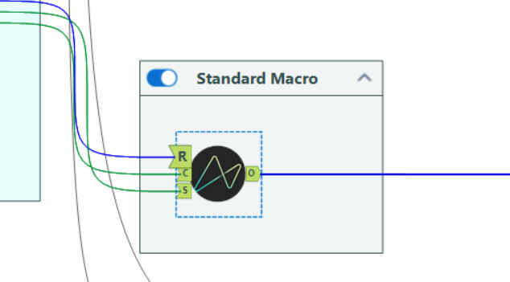

Encapsulates repeated join and cleansing logic.

**Design Decision**

One macro replaces an entire container’s worth of logic, guaranteeing consistency and simplifying maintenance.

Macros ensure business rules are defined once and reused everywhere.

---

### Batch Macro – Aggregation Engine
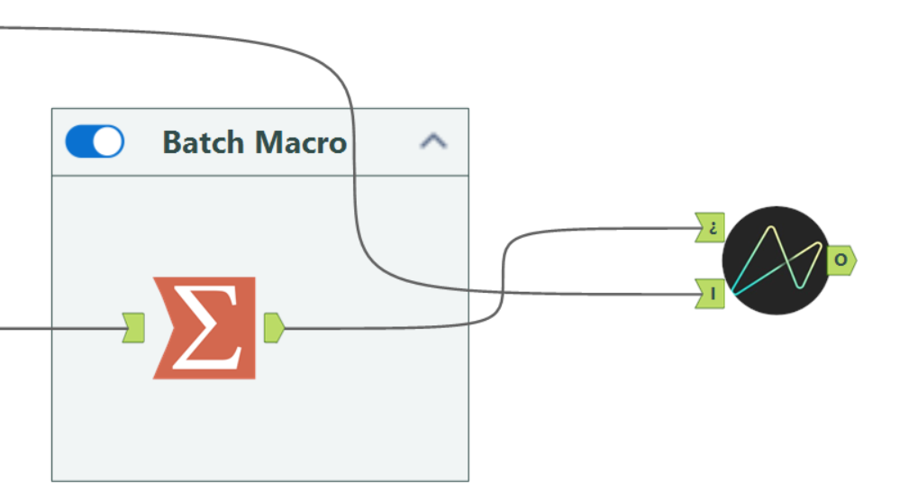

Parameter-driven aggregation framework.

**Design Decision**

Batch macros eliminate duplicated summarize logic and enable scalable metric generation.

This allows new metrics to be created by configuration rather than rewiring workflows.

---

## 🧠 Analytic Application

### Analytic App – Tableau Hyper Output
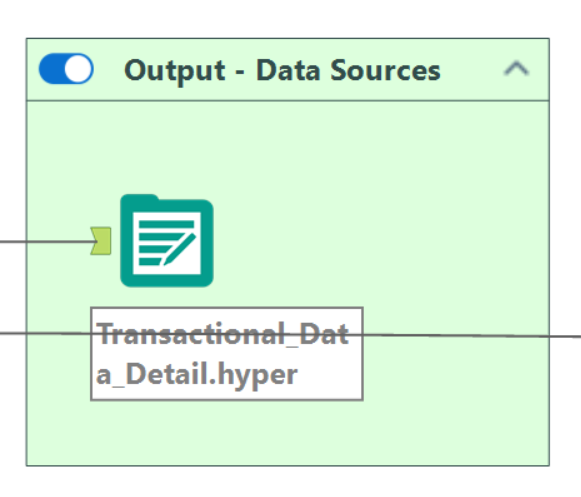

Generates a Tableau `.hyper` extract.

**Design Decision**

Allows business users to generate extracts without modifying the workflow while protecting core logic.

This separates consumption from engineering.

---

## 📤 Engineered Dataset Example

### Google Reviews Unioned Dataset
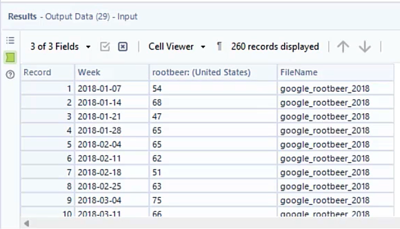

Multi-year Google review files consolidated into a single analytical dataset.

**Design Decision**

Union-based consolidation supports incremental growth without manual merging.

New yearly files can be added without modifying transformation logic.

---

## 🧾 Automated Reporting Outputs

### Market Analysis Report – Visual Layout
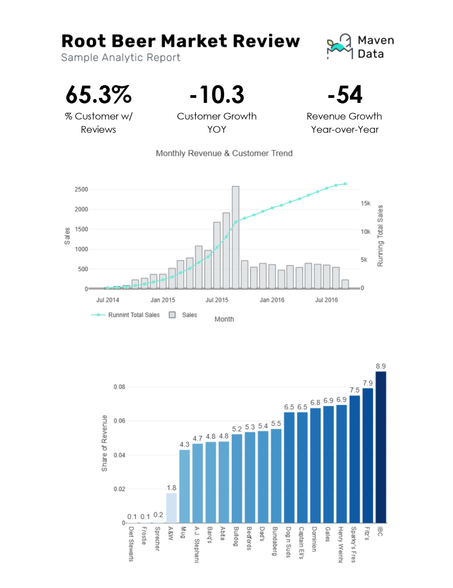

Chart-driven executive report assembled using Interactive Chart and Visual Layout tools.

Built entirely inside Alteryx to ensure reproducibility.

---

### Trade Area Map Report – PDF
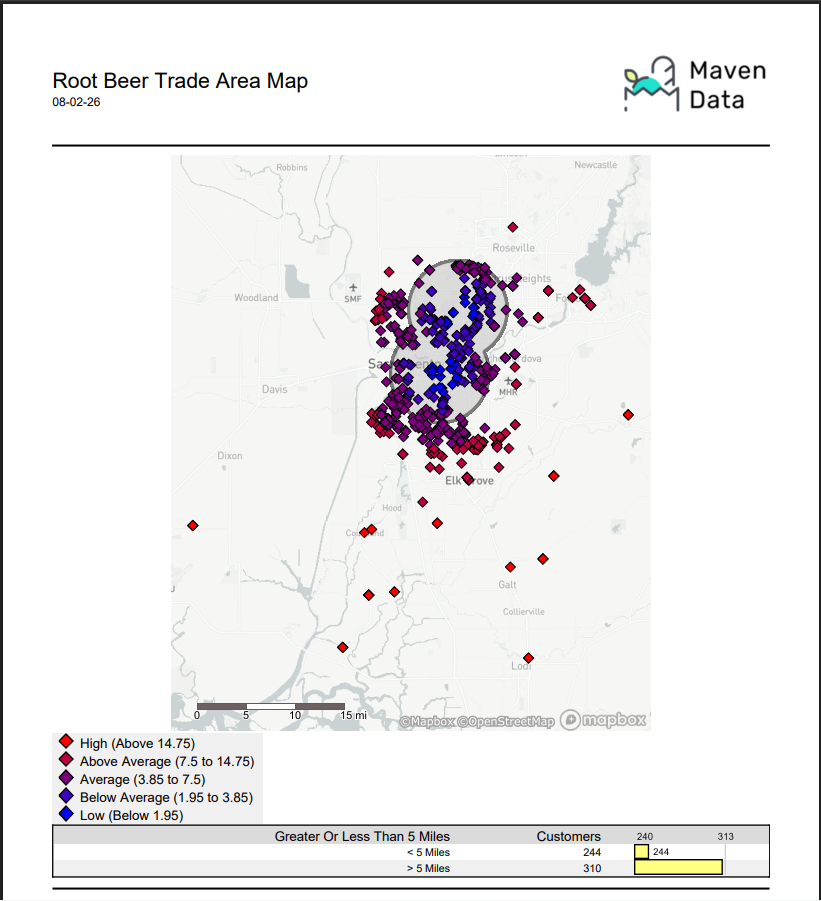

Spatial map report built using Report Map, Legend Builder, Layout, and Render.

**Design Decision**

Reports are produced directly inside Alteryx so they always reflect the latest data and logic.

No manual formatting steps are required.

---

## 📦 Final Outputs (Downloadable)

- **Google Unioned Output.xlsx** – consolidated Google reviews dataset  
- **Sample Market Analysis Report_Overlay_Final.docx** – branded Word report  
- **Trade Area Map Report_Final.pdf** – spatial trade area report  
- **Transactional_Data_Detail.hyper** – Tableau extract  

All generated automatically.

Each output represents a different consumption mode: spreadsheet, document, PDF, and BI extract.

---

## 💾 How to View & Run

1. Download repository  
2. Open `Alteryx__Macros_and_Applications.yxmd`  
3. Open in Alteryx Designer  
4. Run workflow  
5. Review generated outputs  

No external configuration required.

---

## 🖼️ Full Visuals Gallery

All screenshots (including additional supporting visuals not embedded above) are available in the [`visuals/`](visuals/) folder.

---

## 🏁 Final Takeaway

This project demonstrates Alteryx used as a **true analytics engineering platform**:

- Modular architecture  
- Reusable macros  
- Batch-driven processing  
- Spatial intelligence  
- Automated reporting  

It reflects how production-grade Alteryx systems are designed inside real organizations.
