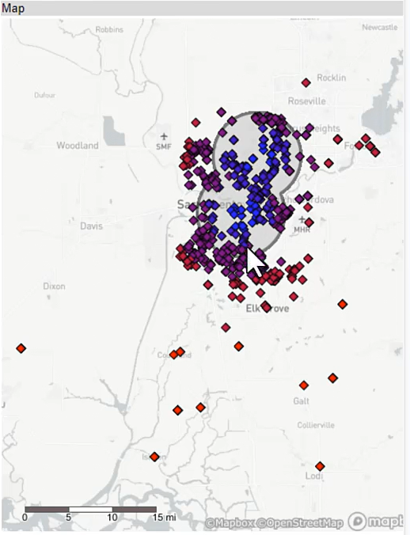
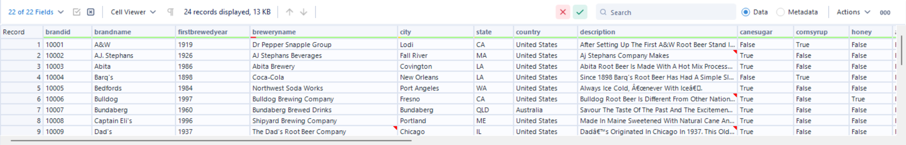
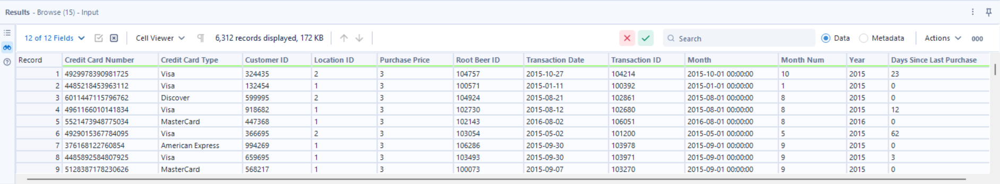
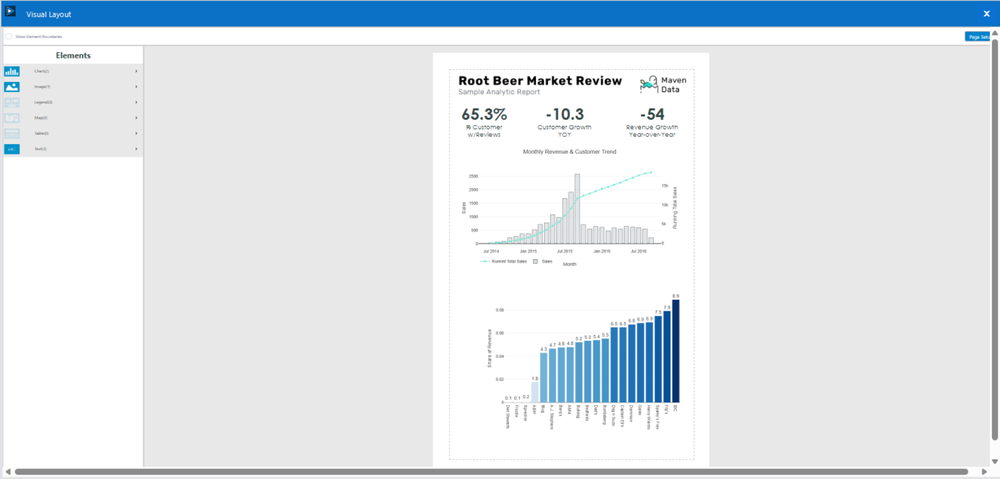
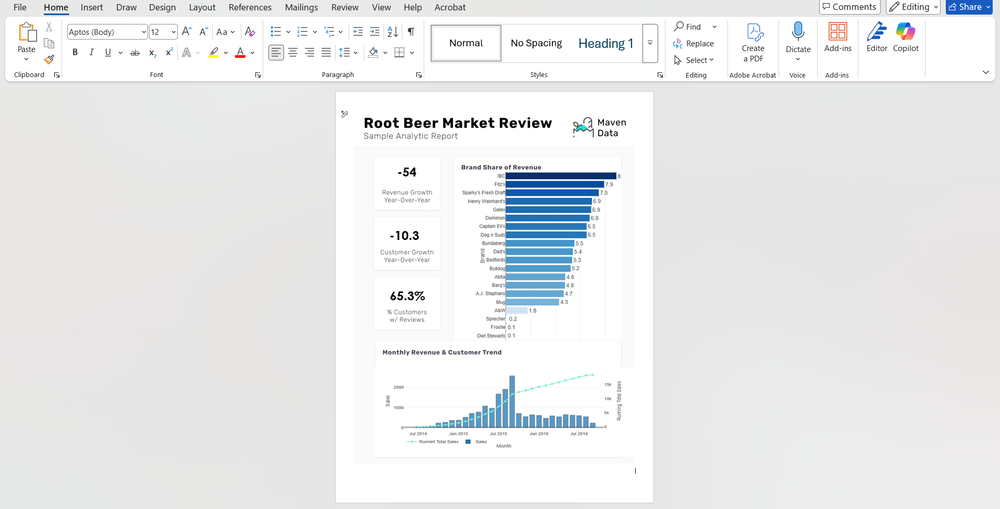

# 🧠 Alteryx | End-to-End Analytics Engineering, Spatial Intelligence & Automated Reporting System

An end-to-end analytics engineering system built in **Alteryx Designer** that ingests raw multi-source retail food & beverage data, engineers analytical datasets, performs spatial modeling, and generates fully automated business reports.

This project demonstrates how raw CSV and Excel files are transformed into **trusted analytical datasets, spatial intelligence, reusable macros, analytic applications, and polished executive-ready reports** through a modular, scalable, and production-style Alteryx workflow architecture.

Rather than focusing on dashboards alone, this project emphasizes **workflow engineering, automation, and architecture design** — showing how complex data pipelines are designed, orchestrated, documented, and operationalized inside Alteryx.

---

## 🚀 Project Overview

This solution was designed as if supporting a retail food & beverage data aggregator responsible for consolidating transaction data, customer information, product details, reviews, locations, and geospatial attributes into a unified analytics foundation.

The workflow handles:

- Multi-source ingestion  
- Extensive data cleansing and preparation  
- Complex joins and transformations  
- Geospatial modeling and trade area analysis  
- Reusable macro development  
- Batch-driven aggregations  
- Analytic application output generation  
- Automated reporting to Excel, Word, PDF, and Tableau Hyper  

**Design Philosophy**

The system is built around three guiding principles:

1. **Modularity** – logic is separated by responsibility  
2. **Reusability** – common logic becomes macros or apps  
3. **Automation-first** – outputs are generated programmatically, not manually  

This ensures the solution can scale in size, complexity, and frequency without becoming fragile.

---

## 🏗️ Architecture Philosophy

The workflow follows a **container-driven, modular architecture**:

- Each major functional area lives inside its own container  
- Heavy transformations are isolated from reporting  
- Spatial analytics is separated from transactional processing  
- Macros abstract repeatable logic  
- Analytic apps expose controlled output generation  

**Why this design?**

Large Alteryx solutions fail when everything lives in one continuous chain.  
Containers create **cognitive boundaries**, allowing developers to understand, test, and modify individual sections without risking the entire system.

This mirrors real enterprise Alteryx standards.

---

## 🔎 Workflow Architecture Overview

### 🔁 Full Workflow Overview

This view illustrates the entire end-to-end system from ingestion through reporting.

**Why show this first?**

Readers immediately understand scale, complexity, and structure before diving into details.

---

### 🧱 Workflow with Containers Labeled

Each container represents a functional domain such as ingestion, preparation, transformations, spatial modeling, macros, batch processing, and reporting.

**Design Decision**

Containers enforce separation of concerns, which:

- Reduces debugging time  
- Prevents accidental logic coupling  
- Enables parallel development  

---

## 📥 Data Ingestion Layer

### Data Inputs Overview

Multiple CSV and Excel files are ingested, including transactions, customers, products, reviews, locations, geolocation references, and fee tables.

**Tools Used**

- Input Data  
- Directory / Dynamic Input  
- Select  
- Browse  

**Design Decision**

All schema control happens immediately at ingestion using **Select** tools.  
This guarantees that every downstream tool receives clean, predictable fields and data types, preventing cascading errors later.

---

## 🧹 Transaction Data Preparation & Integration

### Transactions Data Preparation

Raw transaction data is standardized and relationally integrated.

**Tools & Techniques**

- Data Cleansing  
- Formula / Multi-Field Formula  
- Multi-Row Formula  
- Sort & Record ID  
- Join Multiple  
- Union  

**Design Decision**

Instead of chaining many pairwise joins, **Join Multiple** is used to create a hub-style integration layer.  
This reduces join complexity and improves readability.

All enrichment happens before analytics so that downstream logic always operates on fully integrated records.

---

## 🔧 Advanced Transaction Transformations

### Transactions Advanced Transformations

Creates analytical features and aggregated structures.

**Tools Used**

- Filter  
- Summarize  
- Running Total  
- Append Fields  

**Design Decision**

Raw-level shaping is separated from analytical shaping.  
This allows the same base dataset to support:

- Detail-level reporting  
- Aggregations  
- Batch macros  
- Tableau extracts  

without duplicating logic.

---

## 🗺️ Spatial Analytics & Trade Area Modeling

### Spatial Analysis Workflow

**Tools Used**

- Create Points  
- Distance  
- Trade Area  
- Append Fields  
- Summarize  

**Design Decision**

Spatial logic is isolated into its own container to:

- Prevent spatial objects from polluting transactional streams  
- Allow independent tuning of spatial calculations  
- Enable reuse of trade area logic for future projects  

---

### Trade Area Dataset Preview

Represents the final spatially enriched dataset.

---

## 🧩 Reviews Processing & Structuring

### Reviews Structured Dataset Preview

**Tools Used**

- Text To Columns  
- RegEx  
- DateTime  
- Record ID  
- Auto Field  
- Join / Summarize / Crosstab  

**Design Decision**

Unstructured text is converted into structured analytical columns so reviews can participate in joins, aggregations, and reporting — not remain isolated text blobs.

---

## ♻️ Reusable Macros

### Standard Macro – Reviews ↔ Customers

Encapsulates repetitive join and cleansing logic.

**Design Decision**

Macros enforce consistency and drastically reduce maintenance.  
One fix propagates everywhere.

---

### Batch Macro – Aggregation Engine

Generates multiple aggregation outputs automatically.

**Design Decision**

Instead of building separate summarize streams for each grouping, a batch macro parameterizes grouping logic, enabling scalable metric generation.

---

## 🧠 Analytic Application

### Analytic App – Tableau Hyper Output

Produces a Tableau `.hyper` file.

**Design Decision**

Business users can trigger dataset generation without opening the workflow, increasing accessibility while protecting core logic.

---

## 📤 Engineered Dataset Outputs

### Google Reviews Unioned Dataset

Union consolidates multi-year files.

**Design Decision**

Union-based consolidation avoids manual file merging and supports incremental growth.

---

### Transactions Enriched Dataset

Fully integrated analytical table.

---

### Final Aggregated Metrics Preview

High-level KPIs produced via summarize and batch macros.

---

## 🧾 Automated Reporting

### Trade Area Map Report – PDF Output

Built using Report Map, Legend, Layout, and Render.

**Design Decision**

Reports are generated inside Alteryx so outputs remain tied to data logic — eliminating manual refresh risk.

---

### Market Analysis Report – Visual Layout

Chart-driven report assembled via Visual Layout.

---

### Market Analysis Report – Overlay (Word)

Pixel-perfect branded document via Overlay.

---

## 📦 Final Outputs (Downloadable)

- Google Unioned Output.xlsx – consolidated review dataset  
- Sample Market Analysis Report_Overlay_Final.docx – executive Word report  
- Trade Area Map Report_Final.pdf – spatial map report  
- Transactional_Data_Detail.hyper – Tableau extract  

All generated automatically.

---

## 💾 How to View & Run

1. Download repository  
2. Open `Alteryx__Macros_and_Applications.yxmd`  
3. Open in Alteryx Designer  
4. Run workflow  
5. View outputs  

---

## 🖼️ Full Visuals Gallery

All screenshots and outputs live in the `visuals/` folder.

---

## 🏁 Final Takeaway

This project demonstrates Alteryx used as a **full analytics engineering platform**, not just a prep tool.

It showcases:

- Architectural thinking  
- Automation-first design  
- Reusable engineering patterns  
- Production-style workflows  

Exactly how enterprise Alteryx systems are built.

